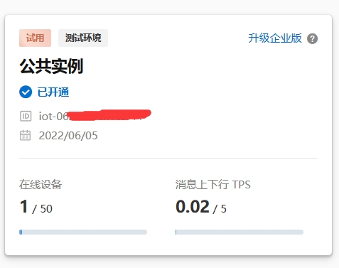

# 阿里云IoT远程唤醒工具

该项目提供了一个脚本，用于通过阿里云IoT服务远程唤醒指定的电脑。脚本与一个在阿里云IoT平台注册的设备进行通信，发送唤醒命令给特定的电脑。该工程从阿里云的[OpenAPI控制台](https://next.api.aliyun.com/api/Iot/2018-01-20/SetDeviceProperty?tab=DEMO&lang=TYPESCRIPT)中导出。

- IotInstanceId实例ID：填写物联网平台的[公共示例](https://iot.console.aliyun.com/lk/summary/new)界面的ID


- ProductKey设备所属的产品**ProductKey**
- DeviceName设备名称
- IotId设备ID：产品密钥和设备名称填写了这个就不用填写了


## 功能描述

- 通过命令行接口，允许用户指定要唤醒的电脑。
- 使用阿里云IoT的API `SetDeviceProperty` 来设置设备的属性。
- 通过环境变量获取阿里云的AccessKey ID和Secret。
- 支持同步和异步执行。

## 运行条件

- Python 3 环境。
- 安装所需依赖，如 `alibabacloud_iot20180120` 和 `dotenv` 等。
- 阿里云账号AccessKey ID和Secret，需要在 `.env` 文件中设置或通过环境变量提供。

## 安装步骤

1. 克隆或下载项目代码到本地。
2. 在项目根目录下创建一个 `.env` 文件，并设置阿里云的AccessKey ID和Secret。
3. 安装所需的依赖。

```sh
python3 setup.py install
```

## 使用方法

在命令行中执行以下命令，其中 `1` 是要唤醒的电脑ID（取值范围为 1 到 4）。

```sh
python wol.py 1
```

## 使用的API

- `SetDeviceProperty`：调用此接口为指定设备设置属性值。详细文档参考：[阿里云官方文档](https://next.api.aliyun.com/document/Iot/2018-01-20/SetDeviceProperty)。

## 返回示例

以下为API调用的可能返回示例，具体以实际调用结果为准。

- JSON 格式返回示例：

    ```json
    { 
      "RequestId": "57b144cf-09fc-4916-a272-a62902d5b207", 
      "Success": true, 
      "Data": {
         "MessageId": "abcabc123"
       } 
    }
    ```

- XML 格式返回示例：

    ```xml
    <SetDevicePropertyResponse>
    <RequestId>57b144cf-09fc-4916-a272-a62902d5b207</RequestId>
    <Success>true</Success>
    <Data>
        <MessageId>abcabc123</MessageId>
    </Data>
    </SetDevicePropertyResponse>
    ```

## 打包发布

```sh
pyinstaller --onefile .\src\wol.py
```
